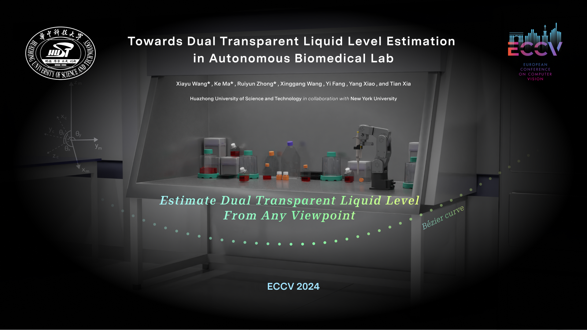
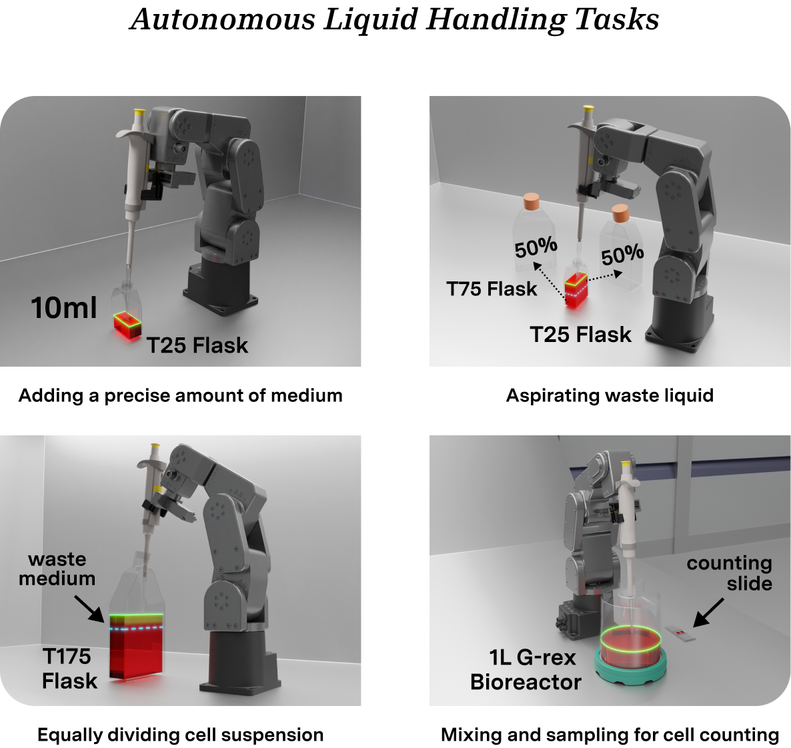
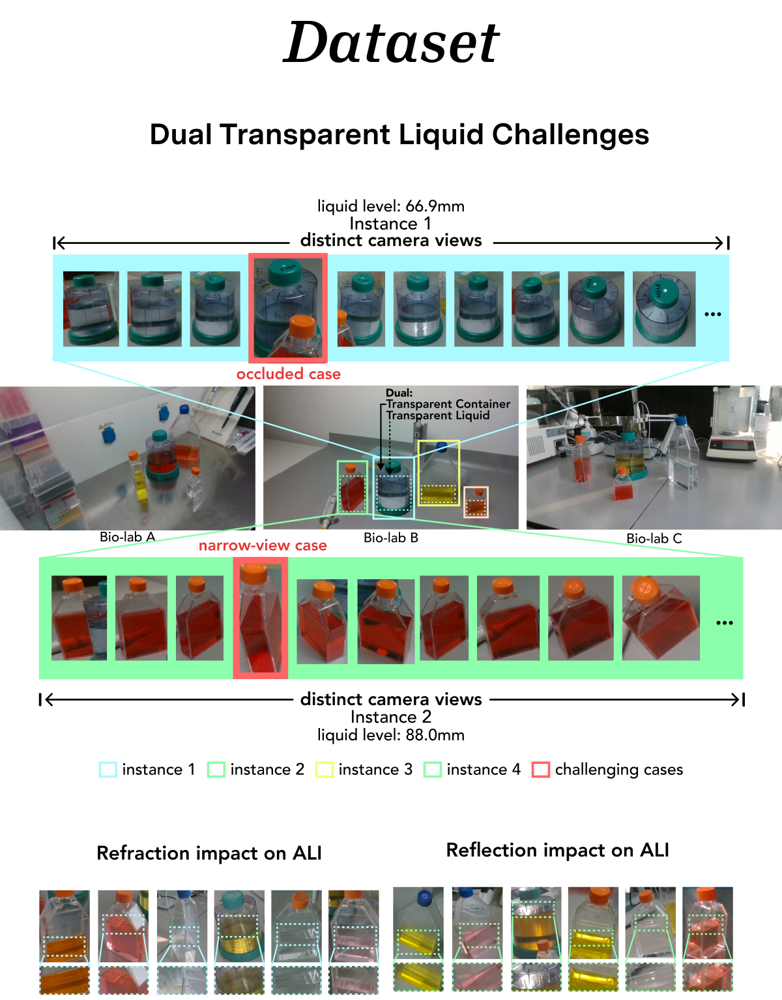
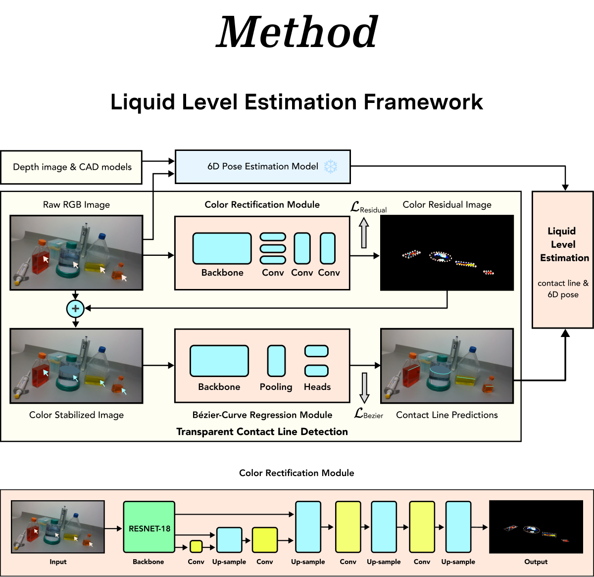
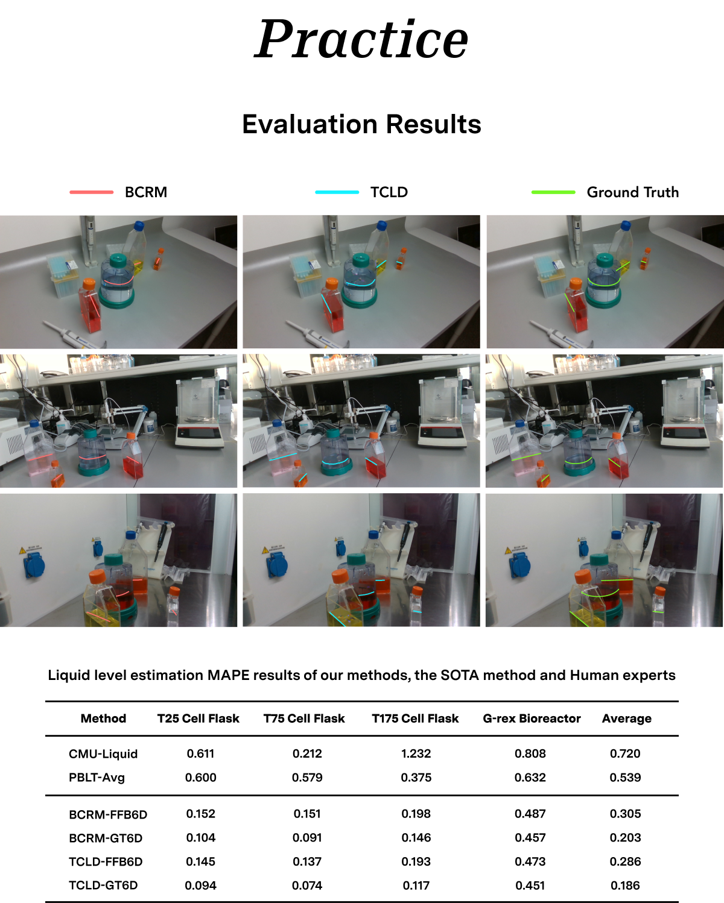

# Towards Dual Transparent Liquid Level Estimation in Biomedical Lab
### Xiayu Wang* , Ke Ma* , Ruiyun Zhong* , Xinggang Wang , Yi Fang , Yang Xiao , and Tian Xia†
*Contributed equally as co-first authors
†Corresponding author

### Website:
Visit our [Project Website](https://dualtransparency.github.io/liquidlevel/) for more information and visual demonstrations.
[[Project Website](https://dualtransparency.github.io/liquidlevel/)](https://dualtransparency.github.io/liquidlevel/)

Our paper is accepted by The 18th European Conference on Computer Vision ECCV 2024 [ECCV 2024](https://eccv.ecva.net/virtual/2024/poster/254)

Code is released!



### Dataset:
You can download the **Dual Transparent Liquid Dataset (DTLD)** from [HuggingFace](https://huggingface.co/datasets/z7r7y7/DLTD).


## Abstract

"Dual Transparent Liquid" refers to a liquid and its container, both being transparent. Accurately estimating the levels of such a liquid from arbitrary viewpoints is fundamental and crucial, especially in AI-guided autonomous biomedical laboratories for tasks like liquid dispensing, aspiration, and mixing. This repository provides the dataset, methods, and code implementation for dual transparent liquid level estimation (DTLD). 

### Key Features:
- **Dual Transparent Liquid Dataset (DTLD)**: Comprises 27,458 images with four object instances captured from multiple views across three biomedical lab scenes.
- **End-to-End Learning Method**: Detects the liquid contact line and estimates the liquid level.
- **Color Rectification Module (CRM)**: Enhances detection by stabilizing color distribution at the air-liquid interface.
- **State-of-the-Art Performance**: Our method achieves high accuracy in real-world biomedical lab tasks.

For more details, please refer to our full [paper (PDF)](docs/ECCV_Paper.pdf) and supplementary [poster](https://eccv.ecva.net/virtual/2024/poster/254).

---

## Introduction

Accurate liquid level estimation is a critical task in AI-guided autonomous biomedical laboratories (ABLs) for tasks such as liquid dispensing, aspiration, and mixing. Our work addresses the challenges of estimating the level of **dual transparent liquids**, where both the liquid and the container are transparent, from arbitrary viewpoints in real-world settings.

##



### Dataset

##
##

The **DTLD dataset** introduces 27,458 images from three biomedical lab scenes, featuring various lighting conditions, liquid colors, and background textures. This dataset is a comprehensive collection to study multi-instance, multi-view, and multi-factor scenarios that accurately represent the complexities of real ABLs.

- **Objects**: Three cell flasks and a cylindrical bioreactor.
- **Views**: Multiple camera views per instance.
- **Lighting Conditions**: Seven different lighting setups.
- **Liquid Colors**: Five different liquid colors.


### Methods

We propose an **end-to-end learning method** that detects the **air-liquid interface (ALI)** by using a **Bezier curve-based regression model** for contact line detection and introduces a **Color Rectification Module (CRM)** to enhance accuracy in challenging conditions. The framework includes a combination of RGB and depth data for robust 6D pose estimation, which is vital for accurate liquid level calculation.

##
##


### Results

Our approach achieves state-of-the-art performance in dual transparent liquid level estimation. Experiments show that our method outperforms existing methods in both detection accuracy and liquid level estimation.



For more detailed results, please refer to our [paper](docs/ECCV_Paper.pdf).

---

### Dataset Access

The **DTLD dataset** is publicly available on [HuggingFace](https://huggingface.co/datasets/z7r7y7/DLTD). The dataset contains annotated images with 6D pose and liquid level ground truth labels.

To download and use the dataset:

```bash
# Clone the repository
git clone https://github.com/dualtransparency/TCLD.git

# Download the dataset from HuggingFace
# https://huggingface.co/datasets/z7r7y7/DLTD
```

---

## Results and Visualizations

The predicted liquid levels and contact line visualizations can be found on our [website](https://dualtransparency.github.io/liquidlevel/). The following image provides an overview of the visual results: [supplementary paper](docs/ECCV_SPmaterial.pdf).

---


<<<<<<< HEAD
Our code is developed based on pytorch-auto-drive.\
Refer to https://github.com/voldemortX/pytorch-auto-drive for more details.

### environment:
Due to server maintenance, the original virtual environment has been lost. The current running environment configuration is as follows:
```
torch==2.4.0
torchvision==0.19.0
cuda==11.8
mmcv==2.2.0
```
### dataset
download DTLD dataset


### train
```
python main_landet.py --train --config <config file path> 
```
eg
```
python main_landet.py --train --config configs/lane_detection/bezierlanenet/resnet34_liquid_aug1b_color.py
```

### test
```
python main_landet.py --test --config <config file path> 
```
eg
```
python main_landet.py --test --config configs/lane_detection/bezierlanenet/resnet34_liquid_aug1b_color.py
```

## Citation

If you find our work helpful in your research, please consider citing our paper:

```bibtex
@inproceedings{wang2024dualtransparent,
  title={Towards Dual Transparent Liquid Level Estimation in Biomedical Lab: Dataset, Methods, and Practices},
  author={Xiayu Wang, Ke Ma, Ruiyun Zhong, Xinggang Wang, Yi Fang, Yang Xiao, and Tian Xia},
  booktitle={ECCV 2024},
  year={2024}
}
```

---

## Links

- [Project Website](https://dualtransparency.github.io/liquidlevel/)
- [ECCV 2024](https://eccv.ecva.net/)
- [Paper](ECCV_Paper.pdf)
- [Supplementary Material](ECCV_Paper.pdf)
- [Poster](https://eccv.ecva.net/virtual/2024/poster/254)
- [Huazhong University of Science and Technology](https://english.hust.edu.cn/)

For more information, please contact us at: [make@hust.edu.cn](mailto:make@hust.edu.cn)
>>>>>>> c41f556024984712f1b99210ad6ccb9048a72002
